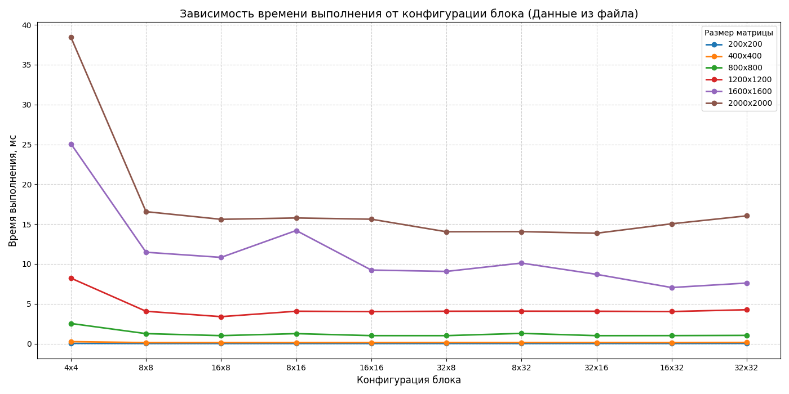

# parallel-programming

Лабораторная работа №4  
Отчётный материал  
Дисциплина: Параллельное программирование  
ФИО: Рябчиков Владислав Евгеньевич  
Группа: 6211-100503D  

1. ### Задание:  
   Модифицировать программу из л/р №1 для параллельной работы по технологии CUDA. Провести эксперименты с разными размерами матриц и различными конфигурациями сетки блоков.
2. ### Описание реализации

В данной работе реализован алгоритм параллельного умножения квадратных матриц размера $N \times N$ с использованием технологии **NVIDIA CUDA**.  

**Основные этапы работы алгоритма:**  

* **Загрузка данных:** Чтение исходных матриц из текстовых файлов.
* **Управление памятью:** Динамическое выделение видеопамяти (VRAM) на устройстве с помощью `cudaMalloc` и копирование данных с хоста (CPU) на устройство (GPU) через `cudaMemcpy`.
* **Параллельные вычисления:** Запуск CUDA-ядра (`kernel`), в котором каждый поток вычисляет один элемент результирующей матрицы.
* **Профилирование:** Измерение времени выполнения вычислений с помощью событий CUDA (`cudaEventRecord` и `cudaEventElapsedTime`).
* **Автоматизированный бенчмаркинг:** Программа выполняет итерационный перебор различных конфигураций блоков для поиска оптимального баланса между количеством потоков и загрузкой мультипроцессоров видеокарты.

3. ### Используемое оборудование  
**Видеокарта:** NVIDIA GeForce RTX 3060 Ti  
**Технология параллелизации:** CUDA  
**Измеряемая величина:** время выполнения kernel, мс  

4. ### Результаты эксперимента:  

| Размер матрицы   | Конфигурация блока   |   Время выполнения, мс | Статус   |
|:-----------------|:---------------------|-----------------------:|:---------|
| 200x200          | 4x4                  |                  0.038 | OK       |
| 200x200          | 8x8                  |                  0.023 | OK       |
| 200x200          | 16x8                 |                  0.022 | OK       |
| 200x200          | 8x16                 |                  0.022 | OK       |
| 200x200          | 16x16                |                  0.023 | OK       |
| 200x200          | 32x8                 |                  0.024 | OK       |
| 200x200          | 8x32                 |                  0.023 | OK       |
| 200x200          | 32x16                |                  0.027 | OK       |
| 200x200          | 16x32                |                  0.026 | OK       |
| 200x200          | 32x32                |                  0.034 | OK       |
| 400x400          | 4x4                  |                  0.259 | OK       |
| 400x400          | 8x8                  |                  0.133 | OK       |
| 400x400          | 16x8                 |                  0.132 | OK       |
| 400x400          | 8x16                 |                  0.134 | OK       |
| 400x400          | 16x16                |                  0.136 | OK       |
| 400x400          | 32x8                 |                  0.142 | OK       |
| 400x400          | 8x32                 |                  0.141 | OK       |
| 400x400          | 32x16                |                  0.142 | OK       |
| 400x400          | 16x32                |                  0.135 | OK       |
| 400x400          | 32x32                |                  0.157 | OK       |
| 800x800          | 4x4                  |                  2.535 | OK       |
| 800x800          | 8x8                  |                  1.262 | OK       |
| 800x800          | 16x8                 |                  1.009 | OK       |
| 800x800          | 8x16                 |                  1.261 | OK       |
| 800x800          | 16x16                |                  1.011 | OK       |
| 800x800          | 32x8                 |                  1.009 | OK       |
| 800x800          | 8x32                 |                  1.293 | OK       |
| 800x800          | 32x16                |                  1.007 | OK       |
| 800x800          | 16x32                |                  1.014 | OK       |
| 800x800          | 32x32                |                  1.04  | OK       |
| 1200x1200        | 4x4                  |                  8.223 | OK       |
| 1200x1200        | 8x8                  |                  4.067 | OK       |
| 1200x1200        | 16x8                 |                  3.391 | OK       |
| 1200x1200        | 8x16                 |                  4.072 | OK       |
| 1200x1200        | 16x16                |                  4.025 | OK       |
| 1200x1200        | 32x8                 |                  4.07  | OK       |
| 1200x1200        | 8x32                 |                  4.08  | OK       |
| 1200x1200        | 32x16                |                  4.068 | OK       |
| 1200x1200        | 16x32                |                  4.032 | OK       |
| 1200x1200        | 32x32                |                  4.259 | OK       |
| 1600x1600        | 4x4                  |                 25.075 | OK       |
| 1600x1600        | 8x8                  |                 11.472 | OK       |
| 1600x1600        | 16x8                 |                 10.828 | OK       |
| 1600x1600        | 8x16                 |                 14.199 | OK       |
| 1600x1600        | 16x16                |                  9.236 | OK       |
| 1600x1600        | 32x8                 |                  9.066 | OK       |
| 1600x1600        | 8x32                 |                 10.114 | OK       |
| 1600x1600        | 32x16                |                  8.698 | OK       |
| 1600x1600        | 16x32                |                  7.043 | OK       |
| 1600x1600        | 32x32                |                  7.609 | OK       |
| 2000x2000        | 4x4                  |                 38.441 | OK       |
| 2000x2000        | 8x8                  |                 16.564 | OK       |
| 2000x2000        | 16x8                 |                 15.602 | OK       |
| 2000x2000        | 8x16                 |                 15.772 | OK       |
| 2000x2000        | 16x16                |                 15.619 | OK       |
| 2000x2000        | 32x8                 |                 14.042 | OK       |
| 2000x2000        | 8x32                 |                 14.059 | OK       |
| 2000x2000        | 32x16                |                 13.858 | OK       |
| 2000x2000        | 16x32                |                 15.042 | OK       |
| 2000x2000        | 32x32                |                 16.038 | OK       |

5. ### Лучшие конфигурации:  
| Размер матрицы | Лучшая конфигурация блока | Лучшее время, мс |
|----------------|---------------------------|------------------|
| 200x200 | 16x8/8x16 | 0.022 |
| 400x400 | 16x8 | 0.132 |
| 800x800 | 32x16 | 1.007 |
| 1200x1200 | 16x8 | 3.391 |
| 1600x1600 | 16x32 | 7.043 |
| 2000x2000 | 32x16 | 13.858 |

6. ### Графики результатов:  

7. ### Вывод:  
В ходе экспериментов было выявлено:  
Технология CUDA сильно зависит от конфигурации блока.  
Для матриц малого размера разница между конфигурациями блоков не сильно заметна. Ощутимый прирост производительности наблюдается у матриц большого размера (1200+) в связке с конфигурациями с большим числом потоков в блоке.  
Лучшими конфигурациями оказались:  
| Размер матрицы | Лучшая конфигурация блока | Лучшее время, мс |
|----------------|---------------------------|------------------|
| 200x200 | 16x8/8x16 | 0.022 |
| 400x400 | 16x8 | 0.132 |
| 800x800 | 32x16 | 1.007 |
| 1200x1200 | 16x8 | 3.391 |
| 1600x1600 | 16x32 | 7.043 |
| 2000x2000 | 32x16 | 13.858 |  

